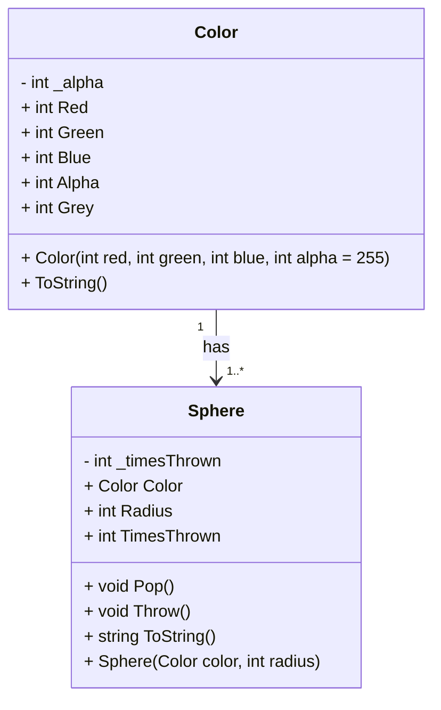

```mermaid
classDiagram
    class Color {
        - int _alpha
        + int Red
        + int Green
        + int Blue
        + int Alpha
        + int Grey
        + Color(int red, int green, int blue, int alpha = 255)
        + ToString()
    }

    class Sphere {
        - int _timesThrown
        + Color Color
        + int Radius
        + int TimesThrown
        + void Pop()
        + void Throw()
        + string ToString()
        + Sphere(Color color, int radius)
    }

    Color "1" --> "1..*" Sphere : has
```
