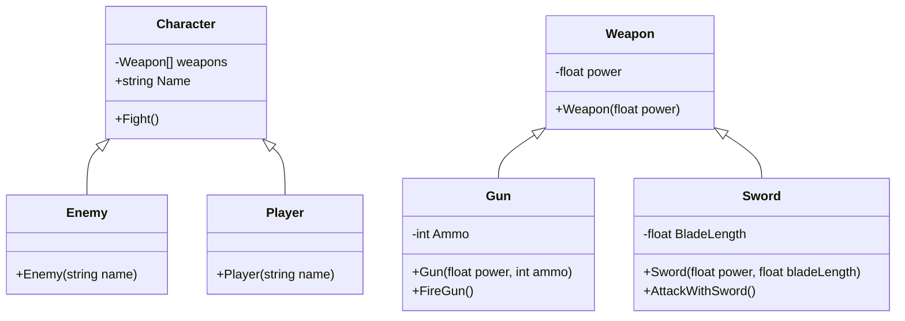

## UML

```mermaid
    classDiagram
    class Character {
        -Weapon[] weapons
        +string Name
        +Fight()
    }
    class Enemy {
        +Enemy(string name)
    }
    class Player {
        +Player(string name)
    }
    class Weapon {
        -float power
        +Weapon(float power)
    }
    class Gun {
        -int Ammo
        +Gun(float power, int ammo)
        +FireGun()
    }
    class Sword {
        -float BladeLength
        +Sword(float power, float bladeLength)
        +AttackWithSword()
    }
    Character <|-- Enemy
    Character <|-- Player
    Weapon <|-- Gun
    Weapon <|-- Sword
```
